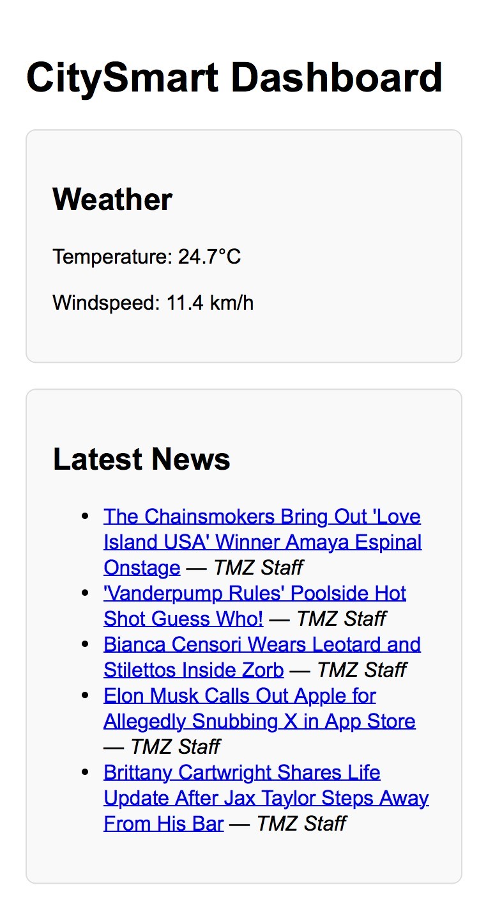
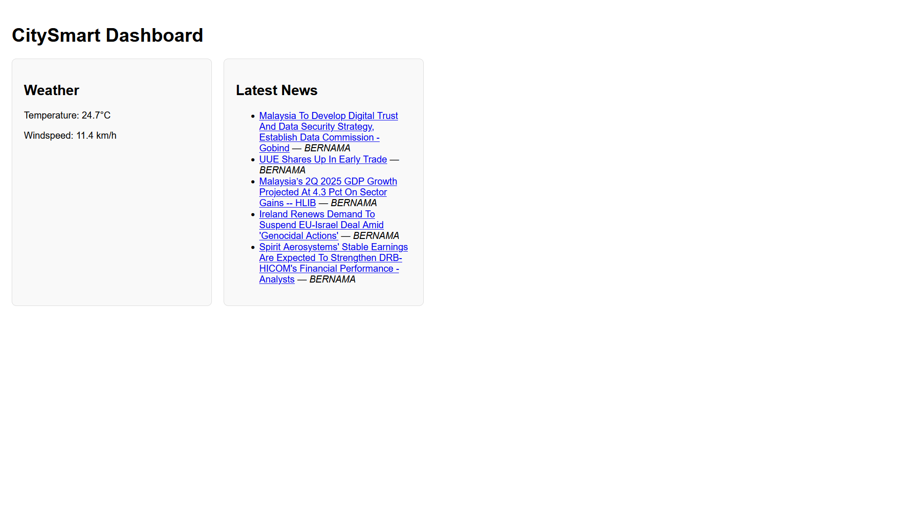

# CitySmart Dashboard

[](LICENSE)
[](https://citysmart-dashboard-sge1-3zosteze8.vercel.app)


CitySmart Dashboard is a responsive web app built with **Vite + React** that serves as your daily city information hub. It fetches real-time weather data and the latest news, making it a one-stop dashboard for urban living.

## 🚀 Features
- **Real-time Weather**: Displays temperature and windspeed for Brampton, ON (Open-Meteo API).
- **Latest News**: Shows top 5 latest headlines (CurrentsAPI).
- **Responsive UI**: Works across desktops, tablets, and phones.
- **Modern Stack**: Built with Vite for blazing-fast development.

## 🛠 Tech Stack
- **Frontend**: React.js, CSS3, HTML5
- **APIs**: Open-Meteo, CurrentsAPI
- **Build Tool**: Vite
- **Version Control**: Git, GitHub

## 📂 Project Structure
```
citysmart-dashboard/
├── public/
├── src/
│   ├── components/    # WeatherWidget, NewsWidget
│   ├── pages/         # DashboardPage
│   ├── assets/        # Images/icons
│   ├── App.jsx
│   ├── App.css
│   ├── main.jsx
│   └── index.css
├── package.json
├── vite.config.js
└── index.html
```

## 🔧 Setup
```bash
npm install
npm run dev
```

## 🌐 Deployment
Deployed with [Vercel](https://vercel.com/) — [**View Live Demo**](https://citysmart-dashboard-sge1-3zosteze8.vercel.app)

## 📸 Screenshots
### Mobile View


### Desktop View


## 📅 Roadmap
- 🌍 Geolocation-based weather
- 🏙 City selection dropdown
- 📦 PWA offline mode

## 📄 License
This project is open source and available under the [MIT License](LICENSE).
